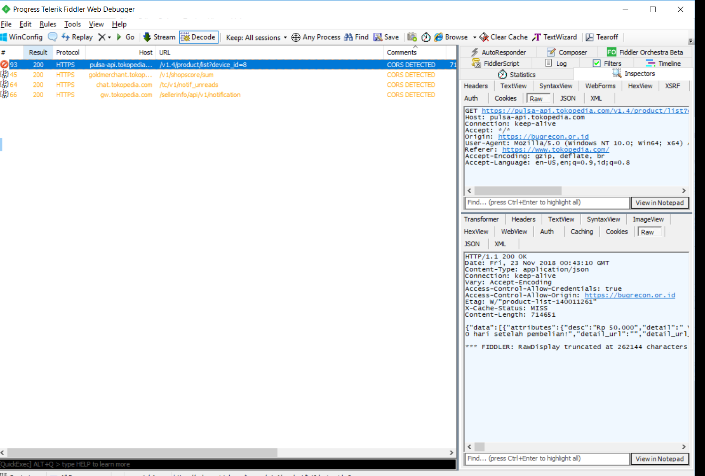

# PENTOL
PENTOL - Pentester Toolkit is built as a plugin for the Fiddler HTTP debugging proxy. 

</img>

# Features
``CORS DETECTED`` Cross-Origin Resource Sharing

``CRLF DETECTED`` HTTP response splitting 

``Headers DETECTED (X-Frame-Options)`` 

# USAGE

- Install [Fiddler2](https://www.telerik.com/download/fiddler/fiddler2)
- Open Fiddler2
- Press Key `CTRL` + `R`  or `Rules` > `Customize Rules...`
- Copy all script [SampleRules.js](https://raw.githubusercontent.com/radenvodka/PENTOL/master/SampleRules.js) 
- Press Key `CTRL` + `S`  for `Save`

Check tools in `Rules TAB`
